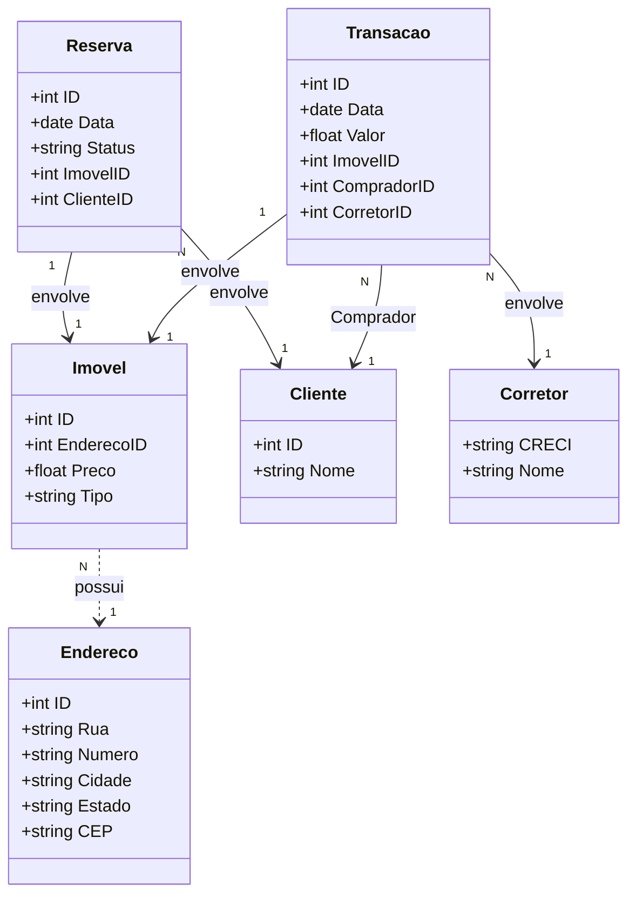

# ImobiliariaAPI

## Diagrama de Classes

```mermaid
classDiagram
    class Imovel {
        +int ID
        +int EnderecoID
        +float Preco
        +string Tipo
    }

    class Cliente {
        +int ID
        +string Nome
    }

    class Corretor {
        +string CRECI 
        +string Nome
    }

    class Reserva {
        +int ID
        +date Data
        +string Status
        +int ImovelID
        +int ClienteID
    }

    class Endereco {
        +int ID
        +string Rua
        +string Numero
        +string Cidade
        +string Estado
        +string CEP
    }

    class Transacao {
        +int ID
        +date Data
        +float Valor
        +int ImovelID
        +int CompradorID
        +int CorretorID
    }

    Imovel "N" ..> "1" Endereco : possui
    Reserva "1" --> "1" Imovel : envolve
    Reserva "N" --> "1" Cliente : envolve
    Transacao "1" --> "1" Imovel : envolve
    Transacao "N" --> "1" Cliente : Comprador
    Transacao "N" --> "1" Corretor : envolve
```
